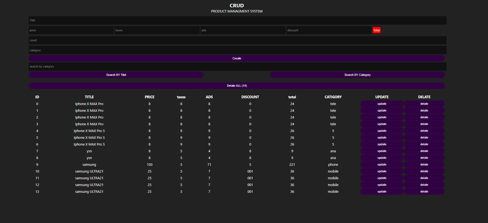

🛒 CRUD Product Management System

A simple CRUD (Create, Read, Update, Delete) web application for managing products.
Built using HTML, CSS, and JavaScript, this app allows users to create, view, edit, delete, and search products with data persistence using Local Storage.

🚀 Features

✅ Create Product — Add new products with title, price, taxes, ads, discount, count, and category.
✅ Read Product — Display all stored products in a table dynamically.
✅ Update Product — Edit any existing product easily.
✅ Delete Product — Delete one or all products at once.
✅ Search System — Search products by title or category.
✅ Auto Total Calculation — Automatically calculates the total price in real-time.
✅ Local Storage Integration — All data is saved in the browser’s local storage.
✅ Responsive Design — Works well on both desktop and mobile screens.

🧠 How It Works

Fill out the form with product details.

The total is automatically calculated as:

total = price + taxes + ads - discount

Click Create to add the product.

Products are displayed in a table with options to:

Update → Edit the product.

Delete → Remove the product.

Delete All → Clear all saved data.

Use the Search bar to find products by title or category.

🧩 Technologies Used

HTML5 → Structure of the web page

CSS3 → Styling and layout

JavaScript (ES6) → Functionality and DOM manipulation

Local Storage → Data persistence in the browser

📁 Project Structure
CRUD/
│
├── index.html        # Main HTML structure
├── style.css         # Styling and layout
├── script.js         # App logic (CRUD + Search + LocalStorage)
└── README.md         # Project documentation

⚙️ Setup Instructions

Download or Clone this repository:

git clone https://github.com/yassinmaftah/Yassine-Projects

Open the project folder.

Run the index.html file in your browser.

Start managing your products!

💡 Example Usage

Add a new product (e.g., Phone, Laptop, etc.)

Modify its details anytime using the Update button.

Delete individual products or clear all data with Delete All.

Search by typing part of the title or category.

📸 Preview

(Add a screenshot or GIF of your app interface here if you want)
Example:

🧑‍💻 Author

Created by: [Yassine Maftah]
📧 Email: yassinemaftah06@gmail.com

🌐 GitHub: https://github.com/yassinmaftah

📝 License

This project is licensed under the MIT License — feel free to use and modify it for your own learning or projects.